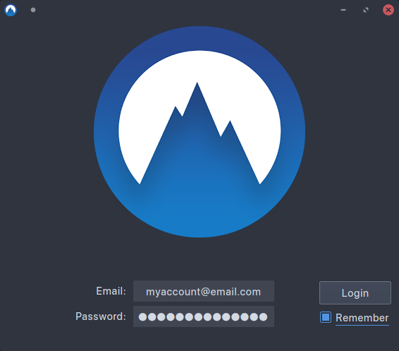
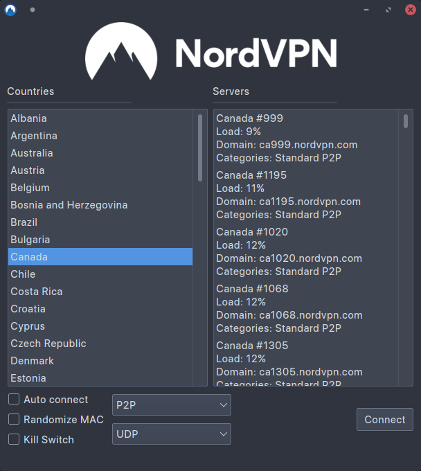

# NordVPN Network Manager GUI
[](https://github.com/mammo0/NordVPN-NetworkManager-Gui/blob/master/LICENSE)
[](https://github.com/mammo0/NordVPN-NetworkManager-Gui/issues)
[](https://github.com/mammo0/NordVPN-NetworkManager-Gui/releases/latest)
[](https://github.com/mammo0/NordVPN-NetworkManager-Gui/commits/master)

[](https://python.org)




### About
NordVPN Network Manager GUI is a graphical frontend for both NordVPN and the system Network Manager.
All connections are handled directly by the network manager and user secrets are only stored in memory before being passed to the Network Manager.
Currently it operates 100% as a user process with no need for root privileges.

This project was inspired by [NordVPN-NetworkManager](https://github.com/Chadsr/NordVPN-NetworkManager) by Chadsr. Many thanks for the code and knowledge that they published into the public domain.

### Features
* Light - Uses the system Network Manager, application doesn't need to be running
* Clean - All configuration files are deleted after disconnection
* Secure - User secrets are passed directly from memory to the Network manager, root access is not required
* Powerful - Supports a variety of different protocols and server types with more on the way.
* Kill Switch - internet connection is disabled if VPN connection is lost
* Auto Connect - VPN is connection is established on system start
* Randomize MAC - Random MAC address is assigned before establishing connection

### Download
[You can download the latest release here.](https://github.com/vfosterm/NordVPN-NetworkManager-Gui/releases/latest)

This is a static linked binary with all dependencies. It just needs execution rights.

### Manual building
**Please do not use `pipenv` for creating the virtual environment! Use the `Makefile` for all actions!**

To run the application without building:
```shell
make run
```

To build the static linked binary:
```shell
make
# or
make build
```

After the build process has finished the installation can be started with:
```shell
make install
```
This step basically calls the `install.sh` script.

For uninstalling call:
```shell
make uninstall
```
This step basically calls the `uninstall.sh` script.

#### Known Issues
* No support for obfuscated servers

## WARNING
Make sure to disable webrtc in your browser of choice. Using WebRTC may leak your original IP address.
